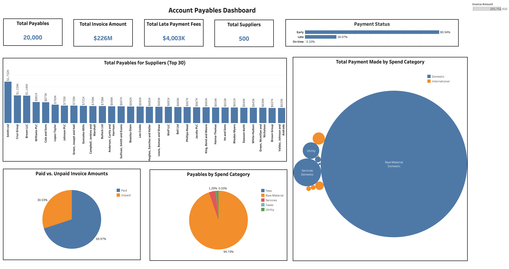
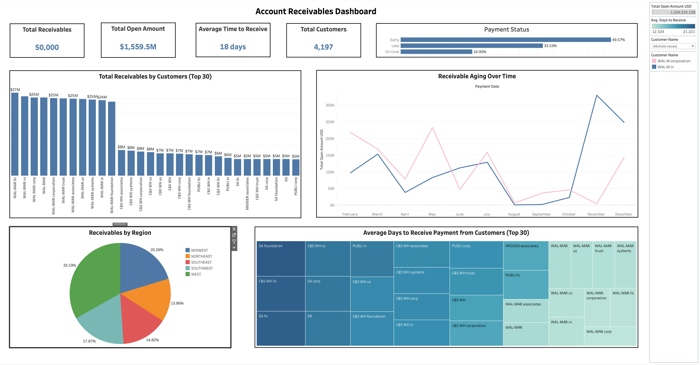

# Working Capital Optimization Dashboard Analysis

## Project Overview
This project focuses on **Working Capital Optimization** through the use of **Tableau** for analyzing receivables and payables data. The goal is to optimize liquidity by improving the management of **Accounts Payable** and **Accounts Receivable**. By leveraging **AWS RDS** to host the data and **PostgreSQL** for database management, this project enables the creation of insightful, data-driven dashboards that stakeholders can use to make informed financial decisions.

### Key Learning Outcomes:
- **Data Analysis Principles**: Understanding the steps, tools, and methodologies for data analysis.
- **Tableau Proficiency**: Using Tableau to load data from SQL Server, manipulate data types, create calculated fields, and build dynamic visualizations.
- **Working Capital Optimization**: Insight into how efficient management of short-term assets and liabilities can improve cash flow and reduce operational risks.

### Business Use Case:
Data Analysis is vital for understanding financial operations, improving efficiency, and making informed decisions. Specifically, **Working Capital Optimization** helps ensure that a company can manage its short-term financial health by balancing **Accounts Receivable** and **Accounts Payable**. This project visualizes these key financial metrics to optimize cash flow and liquidity management.

### Tech Stack:
- **Tool**: Tableau
- **Database**: PostgreSQL hosted on Amazon Web Services Relational Database Service (AWS RDS)
- **Services**: AWS RDS for database management

### Data Source

The dataset was sourced from internal databases and hosted on Amazon Web Services Relational Database Service (AWS RDS). PostgreSQL, a powerful open-source relational database management system, was employed to create, manage, and preprocess the data tables. The dataset encompasses:

- Customer and supplier details
- Accounts receivable and payable information
- Financial metrics including invoice amounts, payment terms, and late fees

After preprocessing, the AWS RDS PostgreSQL instance was directly integrated with Tableau for advanced data visualization and analysis.

### Data Dictionary:
#### Payables Data
| Column Name                        | Description                                      |
|------------------------------------|--------------------------------------------------|
| Invoice Number                     | Unique identifier for the invoice                |
| Posting Date                       | Date the invoice was posted                      |
| Invoice Date                       | Date the invoice was issued                      |
| Payment Date                       | Date payment was made                            |
| Net Due Date (System Calculated)   | Payment due date as calculated by the system     |
| Supplier ID                        | Unique identifier for the supplier               |
| Invoice Amount                     | Total amount of the invoice                      |
| Fiscal Year                        | Fiscal year associated with the invoice          |
| Overdue                            | Whether the payment is overdue                   |
| Invoice Status                     | Status of the invoice (Paid, Unpaid)             |
| Spend Category                     | Category of spending (Fees, Services, etc.)      |
| Total Outstanding Amount           | Amount still unpaid on the invoice               |
| Late Payment Fees                  | Penalties applied for late payments              |
| Payterm_n                          | Payment terms                                    |
| Vendor_Type                        | Type of vendor (Domestic, International)         |

#### Receivables Data
| Column Name                        | Description                                      |
|------------------------------------|--------------------------------------------------|
| Business Code                      | Identifier for the business unit                 |
| Customer Number                    | Unique identifier for the customer               |
| Customer Name                      | Name of the customer                             |
| Payment Date                       | Date the payment was made                        |
| Business Year                      | Year associated with the invoice                 |
| Posting Date                       | Date the invoice was posted                      |
| Due Date                           | Date the payment is due                          |
| Payterm                            | Payment terms                                    |
| Invoice Currency                   | Currency of the invoice                          |
| Total Open Amount                  | Amount outstanding on the invoice                |
| Total Open Amount_USD              | Amount outstanding converted to USD              |
| Invoice ID                         | Unique identifier for the invoice                |
| Customer Payment Terms             | Payment terms for the customer                   |
| Region                             | Region associated with the customer              |

#### Customers Data
| Column Name          | Description                        |
|----------------------|------------------------------------|
| Customer ID          | Unique identifier for the customer |
| Customer Name        | Name of the customer               |
| Customer Payment Terms | Terms of payment for the customer |
| Address              | Customer’s address                 |
| Credit Limit         | Credit limit for the customer      |

#### Suppliers Data
| Column Name       | Description                              |
|-------------------|------------------------------------------|
| Supplier ID       | Unique identifier for the supplier        |
| Supplier Name     | Name of the supplier                     |
| Payment Terms     | Payment terms agreed with the supplier   |
| Vendor Type       | Type of vendor (Domestic, International) |
| Supplier Category | Category the supplier belongs to         |

### Dashboards:
Two key dashboards were created:

#### 1. Account Payables Dashboard:
This dashboard provides insights into the company's accounts payable, showing key metrics such as:
- Total payables, total invoice amount, total late payment fees, and total suppliers.
- A breakdown of payables by suppliers and spend categories.
- Status of payments (early, late, on-time).
- A comparison of paid vs unpaid invoice amounts.

**Insights**:
- The company owes **$226M** in total, with a majority of the unpaid invoices categorized under "Raw Material - Domestic".
- Late payments account for **18.97%** of total transactions, potentially leading to significant late payment fees.
- The top supplier, **Smith Ltd**, has the largest outstanding payable of **$1.27M**.

#### 2. Account Receivables Dashboard:
This dashboard focuses on the company's receivables, displaying:
- Total receivables, total open amount, average time to receive payment, and total customers.
- A breakdown of receivables by customer and by region.
- Receivable aging over time and average days to receive payment from customers.

**Insights**:
- The total receivables amount to **$1.56B**, with an average collection time of **18 days**.
- **WAL-MAR Corp** is the customer with the largest outstanding amount, totaling **$27M**.
- **33.19%** of receivables are concentrated in the **West** region, showing a potential area for faster collection efforts.

### Conclusion:
By visualizing accounts receivable and payable data, the business can optimize working capital, reducing late fees and improving cash flow. These actionable insights allow for more informed decision-making around liquidity management, ensuring that the business remains financially stable while improving operational efficiency.

